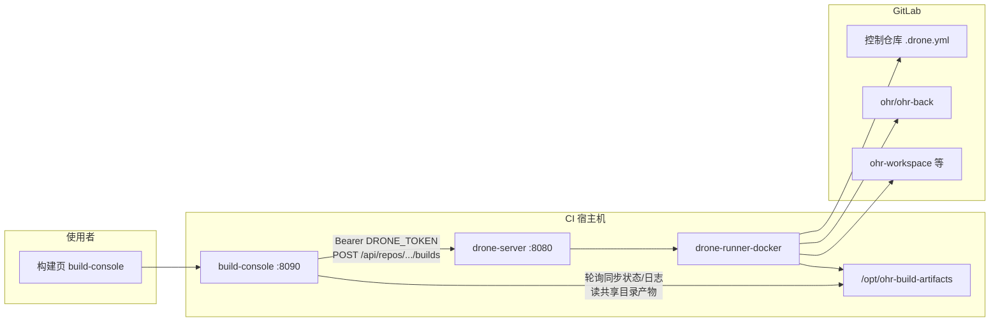

# Drone CI 全链路说明（OHR / hv-vm-tools）

本文档汇总本仓库内与 **Drone Server、Docker Runner、控制仓库流水线、build-console Drone 执行器、运维脚本** 相关的全部信息，便于部署、排障与二次开发。分散在 `deploy/drone/`、`ci/`、`build-console/` 下的说明以此文为索引。

---

## 1. 架构总览



- **direct 模式**：build-console 在本机线程里跑脚本，产物落在 `BUILD_ARTIFACT_ROOT`（默认 `/opt/ohr-build-artifacts`）与每构建目录下。
- **drone 模式**：build-console 只负责创建构建元数据、调用 Drone API 触发**控制仓库**的一次构建；流水线在 Runner 上执行，产物写入宿主机挂载的同一 `BUILD_ARTIFACT_ROOT`；控制台通过 Drone API 同步步骤状态与日志，下载接口优先读共享目录下的 `package.zip` / `web.zip`。

---

## 2. 组件与目录对照

| 组件 | 仓库内路径 | 典型部署路径（CI 机） |
|------|------------|----------------------|
| Drone Server + Runner | `deploy/drone/docker-compose.yml`、`deploy/drone/drone.env`（勿提交密钥，仅用 `drone.env.example` 为模板） | `/opt/drone` |
| 控制流水线定义 | `ci/control-repo/.drone.yml` | 拷贝到 GitLab 上**独立控制仓库**根目录 |
| 仅后端打 `package.zip` 模板 | `ci/.drone.package.yml` | 可作为后端仓 `/.drone.yml` 参考 |
| build-console | `build-console/server.py`、`drone_adapter.py` | `/opt/ohr-build-console` |
| 构建元数据与日志 | — | `BUILD_CONSOLE_DATA_DIR`（默认 `/opt/ohr-build-console/builds`） |
| 产物根目录 | — | `BUILD_ARTIFACT_ROOT`（默认 `/opt/ohr-build-artifacts`，须与 `.drone.yml` 中 host volume 一致） |

控制流水线使用的 **宿主机缓存与产物目录**（见 `ci/control-repo/.drone.yml`）：

| Volume 名 | 宿主机路径 | 用途 |
|-------------|------------|------|
| `pnpm-cache` | `/opt/pnpm-cache` | pnpm store |
| `workspace-cache` | `/opt/workspace-cache-ohr` | 前端 workspace 增量缓存 |
| `m2-cache` | `/opt/ohr-backend/.m2` | Maven 本地仓库 |
| `artifacts` | `/opt/ohr-build-artifacts` | 按 `BUILD_ID` 输出 `package.zip`、`web.zip` |

**首次部署前**在 CI 机执行（示例）：

```bash
sudo mkdir -p /opt/pnpm-cache /opt/workspace-cache-ohr /opt/ohr-backend/.m2 /opt/ohr-build-artifacts
sudo chown -R root:root /opt/pnpm-cache /opt/workspace-cache-ohr /opt/ohr-backend/.m2 /opt/ohr-build-artifacts
```

控制仓库在 Drone 中必须设为 **Trusted**，否则无法使用上述 host path volumes。

---

## 3. Drone Server + Runner 部署

### 3.1 GitLab OAuth 应用

在 GitLab（示例域名 `https://upds7.ujob100.com`，以你方实际为准）创建 OAuth Application：

- **Redirect URI**：与 `DRONE_SERVER_HOST`、`DRONE_SERVER_PROTO` 一致，例如 `http://<NAT 或域名>:3838/login`（见 `deploy/drone/drone.env.example` 注释）。
- **Scopes**：`api`、`read_user`。
- **Confidential**：勾选。

将 **Application ID / Secret** 写入 `DRONE_GITLAB_CLIENT_ID`、`DRONE_GITLAB_CLIENT_SECRET`。

另需确定 GitLab **用户名**（非邮箱），用于：

- `DRONE_USER_CREATE=username:<用户名>,admin:true`
- `DRONE_USER_FILTER=<用户名>`

### 3.2 启动步骤摘要

1. 在 CI 机：`mkdir -p /opt/drone && cd /opt/drone`。
2. 复制 `deploy/drone/drone.env.example` 为 `drone.env`，填写 OAuth、`DRONE_RPC_SECRET`（可用 `openssl rand -hex 16`）、`DRONE_SERVER_HOST`、`DRONE_SERVER_PROTO` 等。
3. 放置 `docker-compose.yml` 与 `drone.env`，执行 `docker compose up -d`。
4. 浏览器访问 `http://<DRONE_SERVER_HOST>`，用 GitLab 账号完成授权。

**端口**：默认映射宿主机 `8080:80`（`drone-server`）。若经 NAT 对外暴露为 `3838`，以外部入口为准配置 OAuth 回调与 `DRONE_SERVER_HOST`。

更细的逐步说明（含示例 IP）仍保留在 [`deploy/drone/README.md`](../deploy/drone/README.md)。

### 3.3 安全提示

- **切勿**将真实 `drone.env` 提交到 Git；仓库 `.gitignore` 已忽略 `deploy/drone/drone.env`。
- `DRONE_RPC_SECRET` 为 Server 与 Runner 共享密钥，需足够随机。

---

## 4. 控制仓库流水线（全量前后端）

### 4.1 仓库与触发方式

- 将 [`ci/control-repo/.drone.yml`](../ci/control-repo/.drone.yml) 推送到你有 Maintainer/Owner 权限的 GitLab 仓库（例如 `sunshaoxuan/ohr-build-control`）。
- 流水线 **trigger.event** 为 `custom`，由 API 创建 build 时携带参数触发（非普通 push 自动跑）。

在 Drone Web 中：**激活该仓库**，并开启 **Trusted**。

### 4.2 Secrets（在 Drone 仓库设置中创建）

| Secret 名 | 说明 |
|-----------|------|
| `ohr_back_git_token` | 可克隆 `ohr/ohr-back` 的 GitLab Token（流水线内以 `oauth2:TOKEN` 形式写 URL） |
| `frontend_git_token` | 可克隆前端 workspace / 子仓的 Token |
| `maven_settings_xml` | 完整 Maven `settings.xml` 内容 |
| `npm_auth_b64` | NPM 私服 `_auth` 的 Base64（与现有私服配置一致） |

### 4.3 步骤与 build-console 对应关系

| Step 名称 | 作用 |
|-----------|------|
| `validate-params` | 校验环境变量中的分支名、`BUILD_ID` 等 |
| `build-backend-package` | 克隆/检出后端分支，`mvn package`，生成 `package.zip` 到产物目录 |
| `restore-frontend-workspace` | Node/pnpm/ohr-cli，恢复或冷克隆前端 workspace 与子仓 |
| `build-frontend-web` | `npm run build`，打 `web.zip` |
| `persist-frontend-workspace` | 将 workspace 同步回 host 缓存目录 |

build-console 在 **drone** 模式下展示的步骤标签与上述 id 对齐（见 `server.py` 中 `DRONE_STEP_IDS` / `drone_labels`）。

### 4.4 Drone API 传入的参数

由 [`build-console/drone_adapter.py`](../build-console/drone_adapter.py) 在触发时以 **Query** 附加到 `POST /api/repos/{DRONE_CONTROL_REPO}/builds`：

| 参数 | 说明 |
|------|------|
| `branch` | 控制仓库分支，来自环境变量 `DRONE_CONTROL_BRANCH`（默认 `master`） |
| `BUILD_ID` | build-console 生成的构建号（与产物子目录名一致） |
| `OHR_BACK_BRANCH` | 后端分支 |
| `FRONTEND_WORKSPACE_BRANCH` | 前端 workspace 分支 |
| `FRONTEND_RELEASE_BRANCH` | 与 workspace 相同（由服务端统一） |
| `FRONTEND_*_BRANCH` | feelin / lowcode / micro-frontends / nocode，当前实现均与 workspace 相同 |

产物路径：

```text
/opt/ohr-build-artifacts/<BUILD_ID>/package.zip
/opt/ohr-build-artifacts/<BUILD_ID>/web.zip
```

流水线内 Git 远程主机名以 `.drone.yml` 中为准（当前模板为 `upds7.ujob100.com`）；若迁移 GitLab，需同步修改 YAML 中的 clone URL。

---

## 5. build-console 的 Drone 模式

### 5.1 环境变量

在 `build-console.env`（或 `BUILD_CONSOLE_ENV` 指向的文件）中配置，完整示例见 [`build-console/build-console.env.example`](../build-console/build-console.env.example)。

| 变量 | 说明 |
|------|------|
| `BUILD_EXECUTOR` | 设为 `drone` 启用 Drone 执行器 |
| `DRONE_SERVER_URL` | Drone API 根地址，CI 机本机常为 `http://127.0.0.1:8080`（与 compose 端口映射一致） |
| `DRONE_TOKEN` | 个人账号在 Drone Web **User Settings → Token** 创建；需有权对控制仓库触发构建 |
| `DRONE_CONTROL_REPO` | `namespace/name`，与控制仓库在 Drone 中的 slug 一致 |
| `DRONE_CONTROL_BRANCH` | 读取 `.drone.yml` 的分支，默认 `master` |
| `BUILD_ARTIFACT_ROOT` | 必须与 Runner 上 `artifacts` volume 的 host path 一致 |

未配置 `DRONE_CONTROL_REPO` 或 `DRONE_TOKEN` 时，`BUILD_EXECUTOR=drone` 下创建构建会直接校验失败（见 `tests/test_build_console.py`）。

### 5.2 行为摘要

1. `POST /api/builds` 创建元数据，`executor` 为 `drone`。
2. `trigger_drone_build` 调用 `DroneExecutorAdapter.trigger`，写入 `metadata.json` 中的 `drone.repo`、`drone.build_number` 等。
3. 前端轮询 `GET /api/builds/{id}` 时，`sync_drone_build` 拉取 Drone build、映射状态与步骤，并把各 step 日志增量追加到本地 `build.log`。
4. 下载 `package.zip` / `web.zip` 时优先读 `BUILD_ARTIFACT_ROOT/<build_id>/`，与 Drone 产物目录一致。

更多 API 列表见 [`build-console/README.md`](../build-console/README.md)。

---

## 6. 仅后端 `package.zip`（旧版 / 独立模板）

若只需在**后端仓库**内通过 Drone 打 `package.zip`，可使用 [`ci/.drone.package.yml`](../ci/.drone.package.yml)，将其内容放到后端仓库根目录 `.drone.yml`（或按 Drone 配置指定文件）。

- Web 上 **Promote**：Target 填 `package`，参数 `OHR_BACK_BRANCH=<分支>`；若无参数框，可将 Target 直接填分支名（详见 [`ci/DRONE_PACKAGE_WEB.md`](../ci/DRONE_PACKAGE_WEB.md)）。
- CLI：`drone build promote <ns>/<repo> <num> package --param OHR_BACK_BRANCH=...`

分支优先级与完整操作说明见该文档。

---

## 7. 运维脚本（本机执行，SSH 连 CI）

均需配置 `hv_vm_tools` 使用的 VM 访问方式（如 `HV_VM_SSH_PASSWORD` 及 `git-access.env` / 相关 env，见项目内 `hv_vm_tools.config`）。

| 脚本 | 用途 |
|------|------|
| [`scripts/remote_deploy_drone.py`](../scripts/remote_deploy_drone.py) | 将 `deploy/drone/docker-compose.yml` 与 `drone.env` 上传到 `/opt/drone` 并 `docker compose up -d` |
| [`scripts/remote_deploy_build_console.py`](../scripts/remote_deploy_build_console.py) | 部署 build-console 及 `drone_adapter.py` 等到 `/opt/ohr-build-console` |
| [`scripts/remote_drone_enable_repo.py`](../scripts/remote_drone_enable_repo.py) | `POST /api/user/repos` 同步列表、`POST` 激活仓库、`PATCH` 设置 `trusted:true`；优先读远端 `build-console.env` 中的 `DRONE_TOKEN` |
| [`scripts/remote_drone_status.py`](../scripts/remote_drone_status.py) | 用 drone-server 日志中的 bootstrap token 调 `/api/user`、`/api/repos/...` 做只读排查，结果写入 `_remote_drone_status.txt` |
| [`scripts/remote_check_drone_control_repo.py`](../scripts/remote_check_drone_control_repo.py) | 读取指定 `namespace/name` 仓库在 Drone 中的元数据 |

**注意**：bootstrap token 通常**不能**用于 `remote_drone_enable_repo` 的完整流程，请在 `build-console.env` 中配置个人 `DRONE_TOKEN`。

---

## 8. 常见问题（FAQ）

1. **Runner 报无法连接 `drone-server`**  
   确认 `docker-compose` 中 `depends_on` 正常、Server 已监听；可查看 `_remote_deploy_drone_log.txt` 或 `docker logs drone-runner-docker`。

2. **流水线报 volume / host path 不可用**  
   控制仓库在 Drone 中未勾选 **Trusted**，或宿主机路径不存在、权限不足。

3. **build-console 触发 401/403**  
   检查 `DRONE_TOKEN` 是否过期、账号是否有控制仓库的 **write** 权限以触发构建。

4. **构建成功但下载 404**  
   核对 `BUILD_ARTIFACT_ROOT` 与 `.drone.yml` 里 `artifacts` 的 host path、`BUILD_ID` 是否与 Drone 步骤中写入路径一致。

5. **OAuth 登录重定向错误**  
   GitLab 中 Redirect URI 必须与浏览器访问 Drone 的 **外部 URL** 完全一致（协议、主机、端口、`/login`）。

---

## 9. 相关文件索引

| 主题 | 文件 |
|------|------|
| Compose 与 env 模板 | `deploy/drone/docker-compose.yml`、`deploy/drone/drone.env.example` |
| 控制流水线 | `ci/control-repo/.drone.yml`、`ci/control-repo/README.md` |
| 后端单包模板 | `ci/.drone.package.yml`、`ci/DRONE_PACKAGE_WEB.md` |
| Drone 客户端封装 | `build-console/drone_adapter.py` |
| 控制台主逻辑 | `build-console/server.py` |
| 配置示例 | `build-console/build-console.env.example` |

文档版本：与仓库主分支一致；若行为与代码不符，以当前 `server.py` / `.drone.yml` 为准。
